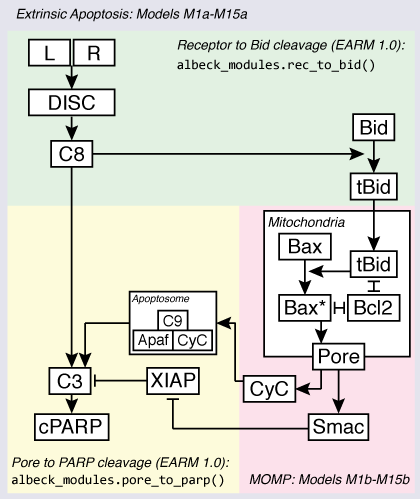

Overview of the models
======================

As the following figure shows, the extrinsic apoptosis pathway can be
considered to have roughly three major regulatory focal points, or "modules":
[Albeck2008]_

- Activation of initiator caspases of Bid by receptor ligation ("Receptor to
  Bid" in the diagram)
- Mitochondrial outer membrane permeabilization (MOMP)
- Effector caspase activation and substrate cleavage ("Pore to PARP cleavage" in
  the diagram)

The models in EARM are focused on exploring alternate hypotheses for the
regulation of MOMP by Bcl-2 family proteins, both as an isolated module and
in the overall context of the extrinsic apoptosis pathway.

Each hypothesis for MOMP regulation by Bcl-2 proteins in EARM thus has two
models associated with it: a **"MOMP-only"** model that can be used to study
the properties of a Bcl-2 reaction topology as an isolated module, and a
**"full apoptosis"** form, in which the different MOMP models are embedded in
the full extrinsic apoptosis pathway which begins with TRAIL or FasL
stimulation. EARM contains 15 alternative Bcl-2 topologies for MOMP; thus there
are 15 Bcl-2 topologies x two versions = 30 models, enumerated `M1a, M1b, ...,
M15a, M15b`. **The "a" suffix denotes the full apoptosis model for a given Bcl-2
topology, while the "b" suffix denotes the corresponding MOMP-only model.**

For the full apoptosis models, the upstream and downstream pathway components
and reaction topologies are re-used from the previously published EARM
1.0 [Albeck2008]_.

The models in EARM
------------------

Below is a list of the 15 alternative Bcl-2 reaction topologies incorporated
into EARM. More detailed descriptions of each model, along with the source
code, are found in :doc:`modules/index`.

- M1a/b: EARM 2.0, Embedded [Lopez2013]_ 
- M2a/b: EARM 2.0, Direct [Lopez2013]_
- M3a/b: EARM 2.0, Indirect [Lopez2013]_
- M4a/b: "Minimal Model" (Figure 11b) from Albeck et al. (2008) [Albeck2008]_
- M5a/b: "Model B + Bax multimerization" (Figure 11c) from Albeck et al. (2008)
  [Albeck2008]_
- M6a/b: "Model C + mitochondrial transport" (Figure 11d) from Albeck et al.
  (2008) [Albeck2008]_
- M7a/b: "Current model" (Figure 11e) from Albeck et al. (2008) [Albeck2008]_
- M8a/b: "Current model + cooperativity" (Figure 11f) from Albeck et al. (2008)
  [Albeck2008]_
- M9a/b: Deterministic model from Chen et al. (2007), Biophysical Journal
  [Chen2007biophysj]_
- M10a/b: Indirect model from Chen et al. (2007), FEBS Letters [Chen2007febs]_
- M11a/b: Direct model from Chen et al. (2007), FEBS Letters [Chen2007febs]_
- M12a/b: Direct model from Cui et al. (2008) [Cui2008]_
- M13a/b: Direct model 1 from Cui et al. (2008) [Cui2008]_
- M14a/b: Direct model 2 from Cui et al. (2008) [Cui2008]_
- M15a/b: Model incorporating Bad phosphorylation from Howells et al. (2011)
  [Howells2011]_

How the model code is organized
-------------------------------

For each of the 30 models, there is a corresponding ``.py`` file containing
the model definition. This way any model can be imported using the
straightforward syntax (for example, for model M1a)::

    from earm.lopez_embedded import model

However the Python files for each individual model in general do not contain
much code--they mainly call functions from other modules. For example,
here is the source code for the file ``earm/lopez_embedded.py``, which
implements model M1a:

.. literalinclude:: ../earm/lopez_embedded.py

As this example shows, the model file calls a series of macros that declare the
monomers (:py:func:`earm.albeck_modules.ligand_to_c8_monomers`,
:py:func:`earm.lopez_modules.momp_monomers`, and
:py:func:`earm.albeck_modules.apaf1_to_parp_monomers`), then calls the macros
implementing the upstream and downstream pathway elements
(:py:func:`earm.albeck_modules.rec_to_bid` and
:py:func:`earm.albeck_modules.pore_to_parp`), and finally calls the macro for
the specific Bcl-2 topology involved: :py:func:`earm.lopez_modules.embedded`.
Since the observables for all of the full apoptosis model variants is the same,
these are declared in the final macro that is called,
:py:func:`earm.shared.observables`.

All of the model ``.py`` files follow this pattern, calling a handful of macros
to declare monomers and observables and select implementations of different
pathway modules.

Note that the ``.py`` model files for the full-apoptosis models (M1a - M15a) 
are found in the top-level ``earm`` module, but the files for the MOMP-only
models (M1b - M15b) are found in the submodule ``earm.mito``.

The documentation for all model files (with links to source code) can be found
at the following links:

.. toctree::
   :maxdepth: 2

   modules/model_list

The details of the various macro implementations are found in the following
four files:

.. toctree::
   :maxdepth: 2

   modules/lopez_modules
   modules/albeck_modules
   modules/shen_modules
   modules/shared

MOMP module "boundaries"
------------------------

In the interest of consistency, all of the models have been defined with the
same boundaries in terms of their position in the overall extrinsic apoptosis
pathway: they are all triggered by the addition of an active BH3-only species
(e.g., tBid) as their most "upstream" event, and they all result in the release
in one or more mitochondrial substances (e.g. Cytochrome C and/or Smac) as
their most downstream event. This represents a compromise between the approach
of the MOMP models described in Albeck et al (in which caspase-8, rather than
tBid, served as the input) and the models of the Shen group, in which active
Bax or Bax pores, rather than Cytochrome C or Smac, served as the output.

While these interface boundaries represent the default condition, they can be
modified by passing parameters in to the module macro. For example, by setting
`do_pore_transport=False` in the call to one of the Shen models, the Cytochrome
C and Smac release reactions are not added, and the models can be directly
compared to their originally published versions. Similarly, the upstream
caspase-8/Bid reactions can be added to the Albeck MOMP models to make them
consistent with their published versions.

.. note::MOMP module initial conditions

    The default initial conditions for the MOMP modules is for there to be
    **none of the apoptosis-inducing BH3-only proteins** (i.e., tBid) present
    by default. This means that to reproduce figures from the original
    publications this initial condition will have to be set appropriately.

    If a Bid initial condition is specified, it is for the full-length,
    untruncated form (i.e., Bid(state='U')).

Since our purpose in using these models is primarily to embed them in a common
pathway context, rather than to reproduce previous results for posterity, our
conclusion in working with them was that it is better to have a consistent
interface by default and reproduce published results by modifying the model
rather than implement the model as published by default and then have to
specifically modify each one separately to fit the pathway context
appropriately.

How to use the models
---------------------

To import a model use the syntax::

    from earm.lopez_embedded import model

That's it. You now have a model object that you can query, simulate, perform
parameter estimation on, etc. If you wanted the MOMP-only version, which are
in the sub-module ``mito``, simply run::

    from earm.mito.lopez_embedded import model

If you want to work with multiple models at the same time (e.g., to compare
them), you can write::

    from earm.chen2007_indirect import model as indirect
    from earm.chen2007_direct import model as direct

For more information on the kinds of analysis you can do using PySB models,
see the `PySB documentation <http://pysb.rtfd.org>`_.

Parameter values
----------------

Parameter values (both rate constants and initial protein concentrations) are
embedded directly in the model code rather than in a separate table or file.
The values in the model definition represent estimates or nominal values and
can be easily overridden using values obtained (for example) by measurement or
parameter estimation algorithms.  We do not maintain a separate list or table of
parameter values, as we have found that the clearest description of the
meaning of a rate parameter is the macro or rule statement in which it is
embedded.

If desired, lists of all model parameters can be obtained via the parameters
instance variable of the model object, i.e.::

    model.parameters

A list of all parameter names can be obtained using the list comprehension::

    [p.name for p in model.parameters]

The code is meant to be read!
-----------------------------

As much as possible, we have attempted to make the code for models themselves
transparent and well-documented. The documentation for each model topology has
been embedded inline in the model source code, and the documentation provided in
the :doc:`modules/index` section of the documentation is drawn directly from
this source.

Moreover, the models have been written using a high-level vocabulary of
frequently re-used macros and motifs, with the aim of revealing broad
similarities and differences between models. The models thus consist of
statements such as::

    translocate_tBid_Bax_BclXL()
    catalyze(Bid(state='T'), Bax(state='M'), Bax(state='A'), klist)

which can be read as saying that "tBid, Bax and BclXL translocate [to the
mitochondrial membrane], and tBid catalyzes Bax from a Mitochondrial (but
inactive) state to an Active state." Understanding the precise mechanisms of
these macros (as expressed in terms of rules and reactions) takes some
familiarity with their implementation, but as there is a fairly limited set
of macros, this should hopefully not present a significant barrier.
